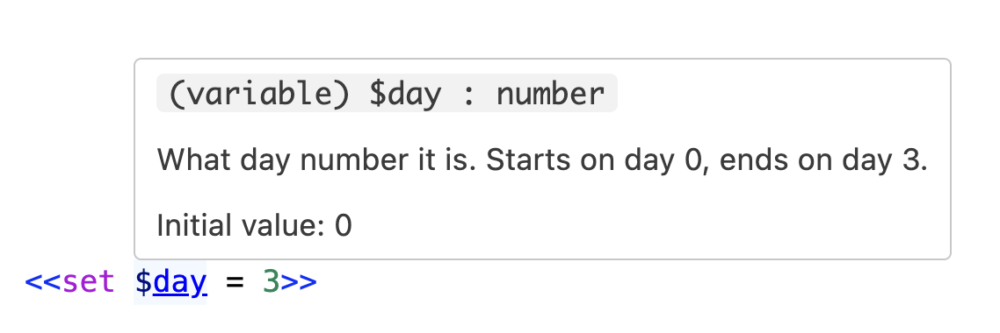

# Expressions and Variables

The Yarn language is a full programming language, which means it has support for writing code that let you control how the dialogue in your game works. In this section, you'll learn how to use **variables** to control your dialogue.

## Variables

**Variables** store information. Variables can store one of three types of information: **numbers**, **strings**, and **booleans**.

| Type | Possible Values | Examples |
| :--- | :--- | :--- |
| Number | Any whole or decimal number | 1, 2.5, 3468900, -500 |
| String | Any sequence of letters, numbers and other characters, enclosed in quotes. | "Hello", "✓", "A whole sentence." |
| Boolean | Either the value _true_ or the value _false_. | true, false |

Every variable has a name. In Yarn Spinner, all variable names start with a dollar sign \(`$`\).

### Declaring Variables

_Declaring_ a variable means telling Yarn Spinner that a variable exists, what it's meant to be used for, and what initial value it has.

To declare a variable, you use the `<<declare>>` statement:

```
/// The name of the player.
<<declare $playerName = "Player">>

/// The number of gold pieces that the player has.
<<declare $gold = 0>>

/// Is the door to the dungeon unlocked?
<<declare $doorUnlocked = false>>
```


If you add a comment with three slashes `///` above a declaration, editor tools like the Visual Studio Code extension will use it to explain what a variable is when it's used elsewhere.

For example, here's a variable that has the following declaration:

```yarn
/// What day number it is. Starts on day 0, ends on day 3.
<<declare $day = 0 as number>>
```

When you hover the mouse over it in Visual Studio Code, a popup will appear that shows the description:




{% hint style="warning"}
If you use a variable without declaring it, Yarn Spinner will try to figure out what type it should have based on how it's being used in your scripts, as well as what initial value it should have - zero for numbers, false for booleans, and blank text for strings. When a variable is not declared, we call that an _implicit_ declaration.

If you declare a variable, you can make sure that the type of the variable is what you intend it to be. Declaring a variable also lets you control what the variable's initial value is, and lets you add descriptive comments that explain the purpose of the variable to other people (or to your future self!)


### Setting Variables

You put information into a variable by using the `<<set>>` command. For example, the following code puts a _string_, `"Hello, Yarn!"`, into a variable called `$greeting`:

```text
<<set $greeting to "Hello, Yarn!">>
```


As with node titles, variable names must not contain spaces. While they can contain a range of different characters the first character must be a letter.
In general your variables will be made up of only letters, numbers and underscores.


### Variables and Types

Each variable can only store one type of value. Variables can change their value at any time, but they can never change their type.

For example, the following code will work:

```text
// Set some initial values in some variables
<<set $myCoolNumber to 7>>
<<set $myFantasticString to "wow, text!">>

// Now change them!
<<set $myCoolNumber to 8>>
<<set $myFantasticString to "incredible!">>
```

This works because while the value of each of the variable changes, the type doesn't. However, the following code will **not** work:

```text
// Set some initial values in some variables
<<set $myCoolNumber to 7>>
<<set $myFantasticString to "wow, text!">>

// This will NOT work, because you can't change types!
<<set $myCoolNumber to "8">>
<<set $myFantasticString to 42>>
```


In earlier versions of Yarn Spinner, variables could also be `null`, which represented "no value". Starting with Yarn Spinner 2.0, variables are never `null`. All variables are required to have a value.


```text
<<set $variableName to "a string value">>
```

### Variables and Expressions

You can work with the values inside variables. For example, numbers can be multiplied, strings can be added together, and boolean values can have logical operations \(like _and_ and _or_\) applied to them. When values are used together like this, it's called an **expression**.

```text
<<set $numberOfSidesInATriangle = 2 + 1>>

<<set $numberOfSidesInASquare = $numberOfSidesInATriangle + 1>>
```

An expression needs to be a single type. You can't work with values of different types in a single expression. For example, the following code will **not** work:

```text
// This will NOT work, because you can't add a string and a number:
<<set $broken = "hello" + 1>>
```


Yarn Spinner provides built-in functions for converting between certain types:

* The `string` function converts values of any type into a string.
* The `number` function converts values of any type into a number (if it can be interpreted as one.)
* The `bool` function converts values of any type into a boolean value (if it can be interpreted as one.)


#### Logical operators

Yarn Spinner supports the following logical operators. Most of these have multiple ways being written:

- Equality: `eq` or `is` or `==`
- Inequality: `neq` or `!`
- Greater than: `gt` or `>`
- Less than: `lt` or `<`
- Less than or equal to: `lte` or `<=`
- Greater than or equal to: `gte` or `>=`
- Boolean 'or'': `or` or `||`
- Boolean 'xor': `xor` or `^`
- Boolean 'not': `not` or `!`
- Boolean 'and': `and` or `&&`

#### Maths operators

- Addition: `+`
- Subtraction: `-`
- Multiplication: `*`
- Division: `/`
- Truncating Remainder Division: `%`
- Brackets: `(` to open the brackets and `)` to close them.

#### Order of operations

Yarn Spinner follows a fairly standard order of operations, and falls back to using left to right when operators are of equivalent priority.

The order of operations is as follows:

1. Brackets
2. Boolean Negation
3. Multiplication, Division, and Truncating Remainder Division
4. Addition, Subtraction
5. Less than or equals, Greater than or equals, Less than, Greater than
6. Equality, Inequality
7. Boolean AND, Boolean OR, Boolean XOR

### Using Variables in Lines

To show the contents of a variable, you put it inside braces \(`{ }`\) inside a line. The value of that variable will appear in its place.

For example:



```text
<<set $variableName to "a string value">>
The value of variableName is {$variableName}.
```



```
The value of variableName is a string value.
```



## Variables and Storage

Yarn Spinner doesn’t manage the storage of information in variables itself. Instead, your game provides a _variable storage_ object to Yarn Spinner before you start running dialogue.

When Yarn Spinner needs to know the value of a variable, it will ask the variable storage object you’ve given it. When Yarn Spinner wants to set the value of a variable, it will provide the value and the name of the variable. In this way, your game has control over how data is stored.

The specifics of how variables need to be stored will vary depending on what game engine you're using Yarn Spinner in. To learn more about variable storage in Unity, see [Variable Storage](../../using-yarnspinner-with-unity/components/variable-storage/README.md).

