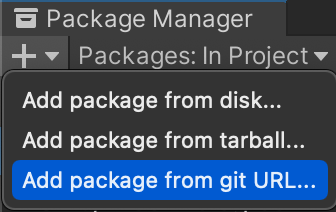

# Installing Yarn Spinner for Unity

## **Install the Yarn Spinner package**

* Choose _Window — Package Manager_ to open the Package Manager.
* Click the _+_ button in the corner of the Package Manager pane, and choose _Add package from git URL..._

* Enter the following URL: [`https://github.com/YarnSpinnerTool/YarnSpinner-Unity.git#develop`](https://github.com/YarnSpinnerTool/YarnSpinner-Unity.git#develop)
* Allow Unity to import the package. This might take a moment.

* You can verify that everything is imported succesfully by looking for Yarn Spinner under Packages, in the Project pane.

