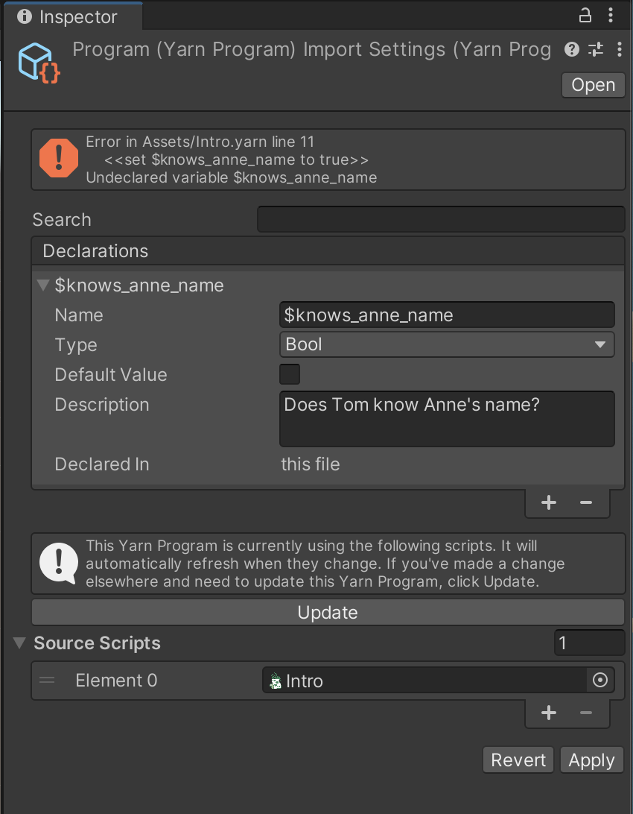

# Working with the script in Unity

## Creating a Yarn Spinner Program from your Script

* Select the script asset in the Project pane in Unity.

* With the script selected, look at the Inspector and click the Create New Yarn Program button.

When you do this, a new Program asset should appear in your Project pane.

## Setting up your Yarn Spinner Program

We need to tell the Yarn Spinner Program about the variable we created in our Yarn Spinner script: `$knows_anne_name`

* Find the new Program asset that's appeared in your Project pane and select it.

* Click the + button in the Declarations section of the Inspector.

* Update the new declaration as follows, then click the Apply button:

