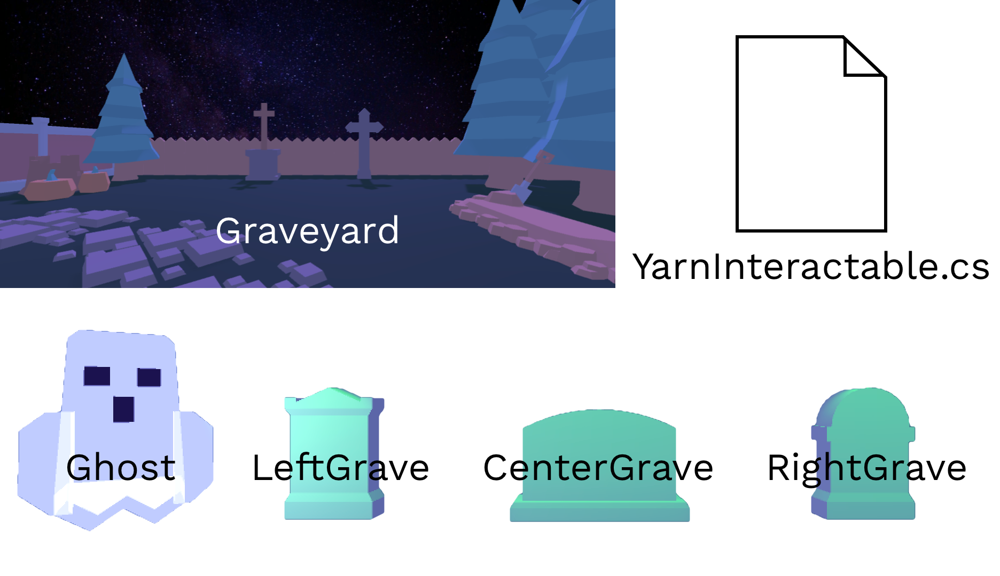
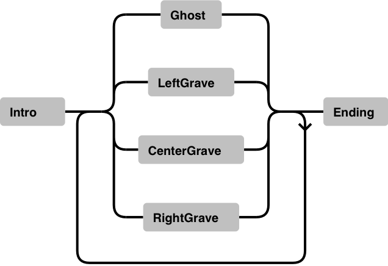

# 🛠 NPC Dialogue Game


This guide is **incomplete**. On the 27th January 2022 it was made public because of technical constraints that dictate that critical updates to other pages would otherwise not be pushed.

Within a few days of this being made public it should be completed, but if you find it now in its current state just **ignore it** (or feel free to bug Mars about it in the Yarn Spinner Discord).


## Goals

1. Display Yarn dialogue in a Unity scene
2. Allow a player to select between options to respond
3. Use Yarn Spinner to trigger commands that change the scene
4. Allow a player to select among available characters to speak to

## Materials

* Yarn Spinner installed in Unity
* Yarn Spinner set up in a text editor
* [**Starter Asset Package**](https://github.com/YarnSpinnerTool/ExampleProjects/releases/download/v2.0/Ghosty.Lads.Assets.unitypackage) downloaded and unzipped

## Instructions

Open a new Unity 3D project. Ensure Yarn Spinner has been added to the project in the Package Manager as per the [**Installation Instructions**](../using-yarnspinner-with-unity/installation-and-setup.md).


Drag the provided Asset Package into the **Project Window** where project files are displayed in Unity to import them into the project.


This package includes with the following assets and functionality:

1. A simple, static environment called **Graveyard** which also contains four character models.
2. A **C# script** that provides simple functions for the character objects.
3. A **Timeline** that stores the hovering animation for the Ghost character.
4. Some **Lights** that turn on and off to indicate when a Grave character is speaking.



### Creating a Runnable Script


The next step is to import the Dialogue System and hook up a Yarn Project and Yarn Script. If you have completed [**Example Project 1**](../using-yarnspinner-with-unity/example-project-1.md) or [**Example Project 2**](../using-yarnspinner-with-unity/example-project-2.md) before, you may skip ahead to [**Filling Out Your Script**](npc-dialogue-game.md#filling-out-your-script). Otherwise, let's proceed!


Yarn Spinner for Unity comes with a pre-made UI layer and accompanying utility scripts to handle displaying lines and presenting options from Yarn files. In the **Project Window** again, navigate to **Packages > Yarn Spinner > Prefabs** and drag **Dialogue System.prefab** into the scene.


When the **Dialogue System** in the scene is selected, the **Inspector** will display the Yarn Project it is expecting line from. Here, a **Yarn Project** is a kind of linking file that groups Yarn script files together. To make one, navigate to a sensible place for the file to live (such as **Assets > Dialogue**) and right-click the **Project Window** pane to select **Create > Yarn Spinner > Yarn Project**.


The existence of Yarn Projects allows larger games with multiple dialogue systems (e.g. main story dialogue, barks, storylets) to separate into multiple projects that pass lines to different UI or systems. This allows an extra level of organisation above separate Yarn files which are typically used to separate story scenes or parts.

However, most games will need only a single Yarn Project.


Select the scene's **Dialogue System** again and drag the new **Yarn Project** into the labelled slot in the **Inspector**.


Now the Yarn Project needs one or more **Yarn Scripts** to get dialogue from. Just like with the Yarn Project, navigate to the desired file location and select **Create > Yarn Spinner > Yarn Script**. Then, with the Yarn Project selected, drag the newly created script into the Inspector slot labelled **Source Scripts**. Click **Apply**.


### Filling Out Your Script

By default, a new Yarn Script begins with a single empty node with the name of the file. Open the file, rename the node to **Start** and put a single line of test dialogue. You may remove the `tags` field.

```
title: Start
---
This is a line of test dialogue.
===
```

Returning to Unity, pressing the ▶️ button results in the test line being displayed in front of the graveyard scene. Pressing **Continue** will make the UI disappear, as it has reached the end of the script.


It's time to plan a story. In the scene there are four characters—**Ghost**, **LeftGrave**, **CenterGrave**, and **RightGrave**—and the intent of this game is for the player to be able to interact with them in virtually any order to complete the objectives of the game. This game format typically accompanies stories where the player must piece together information from smaller tidbits given to them when they speak to different characters.&#x20;


For example: _neither Witness A nor B knew who stole the cookie from the kitchen, however:_

* _Witness A knew the cookie was taken in the morning._&#x20;
* _Witness B knew that Suspects A and B entered the kitchen in the morning and afternoon, respectively._

_Together, their clues show that Suspect A must have eaten the cookie._


So, when the game begins, **Ghost** will present some mystery. Once a brief context-establishing conversation ends, the player will be free to select which character to speak to next. Speaking to each of the **Grave** characters will present a clue, provided the required prerequisite clues are known. At any time, the player can present their collated clues to Ghost. If their clues are complete, Ghost will tell them they solved the mystery and the game will end.

This short story provides a looping circuit through four paths, and results in the player reaching the ending after an undetermined number of conversations (though there is a hypothetical minimum, there is no maximum). A railroad diagram representation of the story would look as follows:



So it's time for the actual writing part. Here, I've opened my new Yarn Script in **Visual Studio Code** with the **Yarn Spinner Extension** installed as per the [**Installation Instructions**](../getting-started/editing-with-vs-code/installing-the-extension.md). I've written a minimal script that follows the planned story, as a skeleton that can be expanded on later.



Note that in the script I have given our graves some silly names: **Louise** on the **L**eft, **Carol** in the **C**enter, and **Ruby** on the **R**ight.


You can find this example script below to copy. Or if you want to make you own version and need a refresher on how to represent it in Yarn, refer to the [**Syntax and File Structure guide**](../getting-started/writing-in-yarn/).

<details>

<summary>GhostyLads.yarn</summary>

```
title: Start
---
<<set $hasClueA to false>>
<<set $hasClueB to false>>
<<set $hasClueC to false>>
<<set $spokenToLeftGrave to false>>
<<set $spokenToCenterGrave to false>>
<<set $spokenToRightGrave to false>>
Ghost: Welcome to the graveyard! Unfortunately, you're just in time for an unsolved mystery...
Ghost: You'll have to speak to these three to figure out what happened!
// no jumps, this conversation just ends and dumps the player back in the scene
===
title: Ghost
---
Ghost: Are you ready to tell me what happened?
-> Yes
    Ghost: Well, what do you know?
    -> I have no clues.
    -> I have clue A. <<if $hasClueA>>
    -> I have clues A and B. <<if $hasClueB>>
    -> I have clues A, B and C. <<if $hasClueC>>
        <<jump Ending>>
    Ghost: That doesn't sound right...
-> No
Ghost: Go on and speak to those three!
// only jumps if player solved the mystery, else just ends like the node above
===
title: LeftGraveLouise
---
<<if not $spokenToLeftGrave>>
    Louise: What do you want to know?
    <<set $spokenToLeftGrave to true>>
<<else>>
    Louise: Back again? What do you want to know now?
<<endif>>
-> Something that will get me no clues?
-> Something that will get me Clue A? <<if not $hasClueA>>
    <<set $hasClueA to true>>
-> Something relating to existing Clue A? <<if $hasClueA>>
-> Something relating to existing Clue B? <<if $hasClueB>>
-> Something relating to existing Clue C? <<if $hasClueC>>
Louise: ~additional dialogue~
Louise: Ok, bye!
===
title: CenterGraveCarol
---
<<if not $spokenToCenterGrave>>
    Carol: What do you want to know?
    <<set $spokenToCenterGrave to true>>
<<else>>
    Carol: Back again? What do you want to know now?
<<endif>>
-> Something that will get me no clues?
-> Something that will get me Clue B? <<if $hasClueA and not $hasClueB>>
    <<set $hasClueB to true>>
-> Something relating to existing Clue A? <<if $hasClueA>>
-> Something relating to existing Clue B? <<if $hasClueB>>
-> Something relating to existing Clue C? <<if $hasClueC>>
Carol: ~additional dialogue~
Carol: Ok, bye!
===
title: RightGraveRuby
---
<<if not $spokenToRightGrave>>
    Ruby: What do you want to know?
    <<set $spokenToRightGrave to true>>
<<else>>
    Ruby: Back again? What do you want to know now?
<<endif>>
-> Something that will get me no clues?
-> Something that will get me Clue C? <<if $hasClueB and not $hasClueC>>
    <<set $hasClueC to true>>
-> Something relating to existing Clue A? <<if $hasClueA>>
-> Something relating to existing Clue B? <<if $hasClueB>>
-> Something relating to existing Clue C? <<if $hasClueC>>
Ruby: ~additional dialogue~
Ruby: Ok, bye!
===
title: Ending
---
Ghost: You solved it!
===
```

</details>

Once you've got a basic story, pop back into Unity and check the basics:

* [x] Lines display correctly
* [x] Pressing **Continue** advances lines correctly
* [x] Selecting different options have the expected outcomes



Note that at this point, there is no way to progress beyond the intro conversation. All other nodes cannot be reached with the code we have written so far.


### Making Players Interactable

In this game, the player should be able to select an NPC in the scene and have it trigger their repsective conversation. This requires a few things:

* Code to **begin dialogue from a specific node** when a character object is interacted with.
* Code to **disable scene interaction** when any character is already speaking.
* Code to **disable character interaction** when a specific character should not be interactable.

In **Assets > Scripts** there is a C# script that has code to do these things (see headers below), so we just need to connect it to the appropriate places.



```cpp
// this file is attached to every character in the scene and so will affect only
// the targeted character object when functions are called

string conversationStartNode; // the node to run if this character is clicked
bool beginsInteractable; // whether character is disabled by default
bool interactable; // whether character is disabled right now
bool isCurrentConversation; // whether character is currently speaking

// when clicked on, trigger StartConversation()
// (only happens if the character is currently interactable)
public void OnMouseDown();

// disable scene interaction, turn on speaker indicator, and
// run dialogue from {conversationStartNode}
private void StartConversation();

// reverse StartConversation's changes: 
// re-enable scene interaction, turn off indicator, etc.
private void EndConversation();

// make character able to be clicked on
public void EnableConversation();

// make character not able to be clicked on
public void DisableConversation();
```



Add the **YarnInteractable** script to each character in the game: Ghost, LeftGrave, CenterGrave, and RightGrave. Make sure to set their respective `conversationStartNode` values in the Inspector.


Now, if a character is clicked on, Yarn Spinner would run dialogue from the corresponding node. This is made possible with the following logic:

```cpp
public void OnMouseDown() {
    // if this character is enabled and no conversation is already running
    if (interactable && !dialogueRunner.IsDialogueRunning) {
        // then run this character's conversation
        StartConversation();
    }
}

private void StartConversation() {
    isCurrentConversation = true;
    // apply whatever scene changes you need so the player knows who is speaking
    // (e.g. begin character model animation on speaker character)
    // ...except these are graves that don't move so I used a spotlight instead
    // ... ... bc darnit Jim I am a programmer not an animator
    if (useIndicatorLight) {
        lightIndicatorObject.intensity = defaultIndicatorIntensity;
    }
    // tell Yarn Spinner to start from {nodeName}
    dialogueRunner.StartDialogue(conversationStartNode);
}
```

This handles beginning a conversation, but what about ending one? That is a simple case of adding a **Listener** that will trigger a certain function whenever Yarn Spinner broadcasts that it has reached the end of its current dialogue. This requires one line in the `Start` function of **YarnInteractable.cs**...

```cpp
dialogueRunner.onDialogueComplete.AddListener(EndConversation);
```

...that will then trigger the following `EndConversation` function whenever a conversation ends. This performs whatever actions you need to _undo_ whatever changes `StartConversation` made, such as turning off the speaker indicator.

```cpp
private void EndConversation() {
    // check if this is the speaking character, bc all 
    // YarnInteractables receive the "Dialogue Ended" notification at once
    if (isCurrentConversation) { 
        if (useIndicatorLight) {
            lightIndicatorObject.intensity = 0; // turn off light
        }
        isCurrentConversation = false;
    }
}
```


At this point, this may seem done, but there is a critical issue here. Looking back at the ealier goals:

* [x] Clicking on a character **begins dialogue** from their respective node.
* [x] Clicking on a character **while dialogue is already running** does nothing.
* [ ] Clicking on a character **when they should not be interactable** does nothing.

Why that third thing? Well, because the current state of the game allows the player to:

1. Speak to the Ghost to begin the story.
2. Ask the Graves about the mystery.
3. Speak to the Ghost once they have collected the necessary clues.
4. Have Ghost tell them they ✨ solved the mystery  ✨ and say goodbye.
5. Go back and still ask the Graves about the mystery that is already solved.

So there needs to be a way to tell a specific character "no, you are done, don't speak to the player any more". This can be done with a simple **Yarn Command**.


This guide is **incomplete**. On the 27th January 2022 it was made public because of technical constraints that dictate that critical updates to other pages would otherwise not be pushed.

Within a few days of this being made public it should be completed, but if you find it now in its current state just **ignore it** (or feel free to bug Mars about it in the Yarn Spinner Discord).

