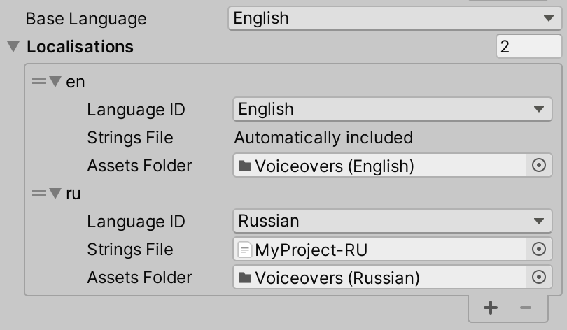
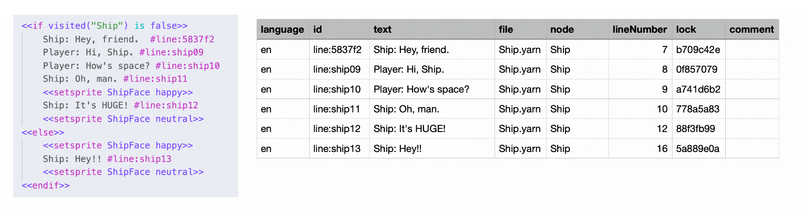

# 🗺 Adding Localizations and Assets to Projects

Localization is the process of translating and adapting content to a specific language, region or culture.

Yarn scripts are written in human-readable language. This is generally a single language, and (most of the time) will be written in the language that your development team primarily speaks. The language that a Yarn project is written in is called the _base language_.

However, if you want your dialogue to be understood by people who don't speak this language, you will need to translate it. Yarn Spinner is designed to make it easy to extract the user-facing text of your dialogue into a _strings file_, which can then be translated into a different language, and then loaded at run-time. You can translate your project into as many languages as you'd like, and Yarn Spinner will handle it for you automatically.

Yarn Spinner is also designed around the idea that a line of dialogue may have _assets_ associated with it. Most commonly, this means an audio file that contains an actor performing the line, so that it can be used in your game as a voice-over. These assets are also localisable.


**I just want to add voiceover in a single language. Why do I need to localise, too?**

The philosophy of Yarn Spinner's approach to localisation is: if you want your dialogue to be text-only, and in a single language, you don't need to do anything at all. If you want to do anything else, you will need to set up a localisation and manage it using Yarn Spinner's processes.

We've found that most users who want to start using Yarn Spinner want to quickly get dialogue on the screen, and don't want to do lots of work to get the basics going. That's why we make the simple use-case (text only, a single language) as easy to use as we can.

However, if you're building a game that's voice acted, it makes your life significantly easier if you build your systems with localisation in mind from the start. Additionally, if you have the resources to add voice-over to your project, you should also have the resources to translate your game to other languages (even if you only have voice-overs in a single language.)

To that end, we designed it so that voiceover is intimately tied to localisation, so that you have to at least _start_ thinking about localisation at the start of the process.


## Localisation Terminology

* **Localisation**: A set of information that describes where to find text and assets for a given language.
* **Base language**: The language that your Yarn script files are written in.
* **Strings file**: A text document that contains translated versions of Yarn lines.
* **Line ID**: A unique code that identifies a line of dialogue or an option in the original source text.
* **Localised line**: The text of a line of dialogue, in a particular locale.
* **Localised line asset**: An asset (for example, an audio clip) that's associated for a particular line, in a particular locale. For example, an audio clip containing the voiceover for the line "Hello there", in German.
* **Line provider**: A [component](../components/line-provider/) that receives line IDs from the Dialogue Runner, and fetches the localised line and localised line assets (if present) for the player's preferred locale.

## Localisation Workflow

In Yarn Spinner, the localisation workflow works like this:

1. Write your Yarn scripts. This original content is your 'base' localisation.
2. Add a line ID to each line of dialogue in your script.
3. Set up localisations in the Yarn Project for each of the languages you wish to support. (This includes your base language.)
4. For each localisation besides your base language:
   1. Export a strings file.
   2. Translate its contents into another language.
   3. Associate the strings file with the localisation.
5. If you have assets you want to use with your dialogue, associate the folder that contains those assets with the localisation they belong to, and set up a Line Provider that's able to use those assets (such as an [Audio Line Provider](../components/line-provider/audio-line-provider.md).)
6. During gameplay, set your [Line Provider](../components/line-provider/)'s language to the player's preferred language, and it will fetch the appropriate content for the player to see.

In the following sections, we'll go through each of these steps.

### Writing Yarn Scripts

Every Yarn script is associated with a _base_ language. By default, Yarn Spinner sets the base language to that of your current locale. For example, if your computer is set to use Australian English, then Yarn Spinner will use that as the base language.

The base language of a Yarn Script is controlled by the [Yarn Project](../importing-yarn-files/yarn-projects.md) that it's a part of. You can change the language of your base localisation by changing the 'Base Language' setting on a Yarn Project.

### Adding Line IDs

In order to match different versions of a line, you need to add a _line id_ to each line of dialogue. A line ID is a tag that appears at the end of a line that uniquely identifies a line of dialogue in your game.

Here's an example of a line of dialogue with a line tag:

```
Gunther: I wanted orange! They gave me lemon-lime. #line:1a64a5
```

In this example, the line of dialogue has a line ID of `1a64a5`.

Yarn Spinner can add line IDs to your dialogue for you. To do this, select your Yarn Project, and click 'Add Line Tags to Scripts'. Yarn Spinner will re-write all of the script files, adding a line ID to any line that doesn't already have one.


You can't generate a [strings file](./#creating-a-translation) unless all of the lines in all of the scripts in the Yarn Project have a line ID.


### Set Up Localisations

When you want to prepare a Yarn Project for an additional language, you add a new Localisation in the Yarn Project.

Localisations are how you tell Yarn Spinner where to find the localised lines, and the localised line assets, for a given language.

To create a new Localisation, open the Localisations list in the Yarn Project's Inspector, and click the + button.



Localisations have the following properties:

| Property      | Description                                                                                                                                                                          |
| ------------- | ------------------------------------------------------------------------------------------------------------------------------------------------------------------------------------ |
| Language ID   | The language for this localisation.                                                                                                                                                  |
| Strings File  | A Text Asset containing the translated lines for this Yarn Project's scripts. See [Creating a Translation](./#creating-a-translation) for information on how to create these assets. |
| Assets Folder | A folder containing the localised assets for this localisation.                                                                                                                      |


You can create a localisation for the base language. When you do this, you can provide localised assets for that language.


### Creating a Translation

After you've set up a localisation, you can translate your dialogue into that localisation's language. To do this, you generate a _strings file_.

A strings file is a text-based spreadsheet, in [comma-separated value](https://en.wikipedia.org/wiki/Comma-separated\_values) form, that contains a translated version of your dialogue. Yarn Spinner can generate a strings file for you, based on the [line IDs](./#adding-line-ids) in the dialogue.


You don't need to create a strings file for your base localisation, because Yarn Spinner can generate that for you from your source Yarn scripts. Any localisation whose language ID is the same as your base language will be marked as 'Automatically included'.


To create a strings file, select a Yarn Project, and click the "Export Strings and Metadata as CSV" button. Unity will ask where you want to save the strings file (the metadata file will have the same name as the strings file, but with a "-metadata" appended to it).



A strings file has the following structure:

| Column     | Description                                                                                                                                                                 |
| ---------- | --------------------------------------------------------------------------------------------------------------------------------------------------------------------------- |
| language   | <p>The language code for this line.</p><p>When you export a strings file, this will be the Yarn project's base language.</p>                                                |
| id         | The line ID for this line.                                                                                                                                                  |
| text       | The text of the line, in the language indicated by the `language` column.                                                                                                   |
| file       | The file that the line was originally found in.                                                                                                                             |
| node       | The node that the line was originally found in.                                                                                                                             |
| lineNumber | The line number of the file that the line was originally found in.                                                                                                          |
| lock       | A unique value that Yarn Spinner uses to detect if the line has been modified since the strings file was generated. Don't modify or delete this value.                      |
| comment    | A note indicating the intent and tone of the line. This can be useful for translators who may not have the same background or context for how the line should be delivered. |

Once you've exported a strings file, you can translate it into another language: for each row in the database, change the `language` column to the new language you're translating into, and the `text` column to the translated text of the line.


Only the `language` and `text` columns should be modified by the translator. Don't modify the others; in particular, if you modify the value in the `id` column, Yarn Spinner won't be able to link the translated line to the original version.


The metadata file contains the `id`, `file`, `node`, and `lineNumber` columns (which have the same values as in the strings file). Additionally, it contains a `metadata` column with all the metadata of a line. Only lines that contain metadata will be present in this file. For more information on metadata, see [Tags and Metadata](getting-started/writing-in-yarn/tags-metadata.md).


You can also provide the metadata file to the translator to give them more context and improve localisation accuracy.


Once you have a strings file that's been translated into your target language, you can add it to your Localisation. To do this, drag and drop the translated strings file into the Strings File property of your localisation, and click Apply.


It's possible to update a strings file after you've made changes to your source scripts. For example, you might have added or removed lines, or made changes to the text.

To update a strings file, click the Update Existing Strings Files button at the bottom of the Inspector.

Yarn Spinner will update every strings file that's been added to the Localisations list: new lines will be added, removed lines will be deleted, and lines whose original text has changed since the last time the file was updated will have the text "NEEDS UPDATE" added to the end. This allows you to more easily find which lines need an updated translation.


### Adding Localised Assets

Localised line assets are assets that are associated with a particular line, in a particular localisation. The most common example of this is voice-over lines, which are audio assets that are associated with each line.

Line Providers are responsible for fetching the appropriate assets for a given line and language. For example, the [Audio Line Provider](../components/line-provider/audio-line-provider.md) fetches audio clips, and provides them to voice-over dialogue views.

### Selecting a Language at Run-time

The specific localised line, and localised line assets, that a line provider fetches depends on which language they have been configured to fetch.

The Text Line Provider has a single language option, which controls which language the line will appear in.

The Audio Line Provider has two language options: the language of the text, and the language of the audio files that are retrieved. This means that you can configure it to provide text in one language, and audio in another.


If a line provider is asked to retrieve content for a language that it doesn't have any assets for, it will retrieve the base language version instead.

