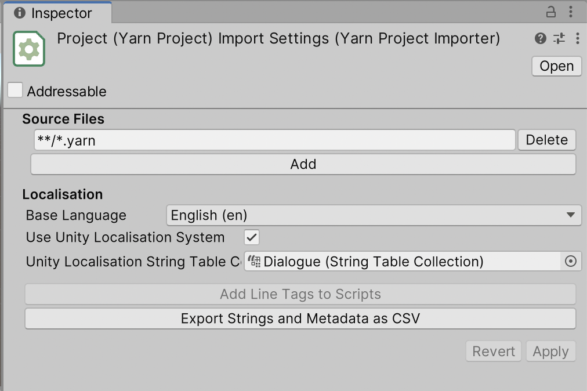

# Yarn Spinner and Unity Localization

In addition to Yarn Spinner's own [built-in localisation system](./inbuilt-localisation.md), your game can also use the Unity Localization package.

Both the Unity Localization and Built-In Localisation approaches are very similar to one another, but there are some caveats and extra steps to make them play together.


The Built-In Localisation system is simpler, but has fewer features.

In this document, we'll refer to the 'Localization' package that Unity provides as 'Unity Localization', to reduce the chance of confusion.


## Getting Started

Before doing anything with Yarn Spinner, you will need to set up your Unity project to use the Unity Localization system. To install and set up Unity Localization, follow the instructions on the [Unity Localization package's documentation](https://docs.unity3d.com/Packages/com.unity.localization@1.0/manual/index.html).

Once you have followed these instructions, your project should now:

1. Have the Unity Localization package installed
2. Created and configured one or more Locales for your project
3. Created a string table collection.


When localising your game's dialogue using Yarn Spinner, we recommend creating a separate string table collection for your dialogue, set apart from other localised content like button labels. It can make it a little easier to manage.


With these done you should now have your project set up correctly, and have a string table collection for your locales with no entries inside. Yarn Spinner will fill this string table with content that it extracts from your Yarn Scripts.

## Importing Default Strings

To fill a string table with content from a Yarn project, follow these steps:

1. Select the Yarn Project, and go to its Inspector.
2. Enable the Use Unity Localisation System setting.
3. Set the `Base Language` to your desired language. This must be ensure its one of the locales that you have configured for your project.
5. In the `String Table Collection` field, add the String Table Collection that you want to populate with line content.
6. Click Apply.

You can check that the string table has been filled with content by opening the Window menu, and choosing Asset Management -> Localization Tables. You can then view the contents of your string table. The Key of each string will be the `#line` ID from the Yarn files.

### String Table Locale Fallback

When the Yarn Project importer adds your lines into the string table, it uses the Base language field you set in the Inspector to determine *which* locale in your String Table Collection should have the lines added into.

If your project doesn't have a Locale which matches your Base Language, Yarn Spinner will attempt to find an appropriate Locale to use. To ensure that the importer uses the correct Locale, be sure to specify it in the Inspector.

## Using the Strings

When a Yarn script is run, the [Dialogue Runner](../components/dialogue-runner.md) receives line IDs from the Yarn Project, and must determine what localised content should be shown to the player, using a [line provider](../components/line-provider/README.md). In order for the Dialogue Runner to fetch localised data from the Unity string table, you use a [Unity Localised Line Provider](../components/line-provider/unity-localised-line-provider.md).


The Dialogue Runner's Inspector will tell you when you need to use a Unity Localised Line Provider. You can click the button it provides to quickly add and configure one. You can also set one up manually, using the Add Component menu.


To configure it, all that needs to be done is hook your string table collection up to the Strings field of the Unity Localised Line Provider.

During gameplay, the Unity Localised Line Provider will fetch content from your string table depending on the game's current locale setting. You can control this at run-time by using the locale selector at the top-right corner of your Game View.

## Localising Assets

In addition to localising the strings that make up your lines, you can also localise _assets_ that go with each line, such as voice-over audio, or custom objects that store other localised data.

To localise assets in Unity Localisation, you create and populate an Asset Table. Yarn Spinner doesn't automatically populate Asset Tables for you like it does String Tables, because Yarn Spinner doesn't manage your assets like it does with your lines. 

Instead, you can create an Asset Table that contains assets with the same key as your lines. For example, if you have a line in your Yarn script that has the line ID "`line:tom-1`", then the string table will have an entry with the key `line:tom-1`. To create a voice-over asset to go with this line, you can create an asset table that _also_ contains an entry with the key `line:tom-1`, and maps to an audio file.

The Unity Localised Line Provider will automatically match String Table entries and Asset Table entries if they have the same key, and then deliver them to your Dialogue Views for use. To do this, ensure that your Unity Localised Line Provider has an Asset Table configured in the Inspector.

## Potential Trip-ups and Caveats

Because both Yarn Spinner and Unity use the same marker for their string interpolation and manipulation (`{` and `}`), you can't use the Unity Localization smart strings in Yarn Spinner content.
