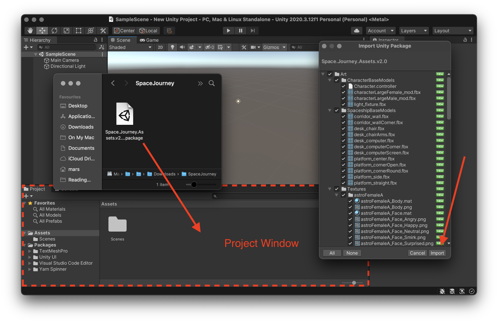
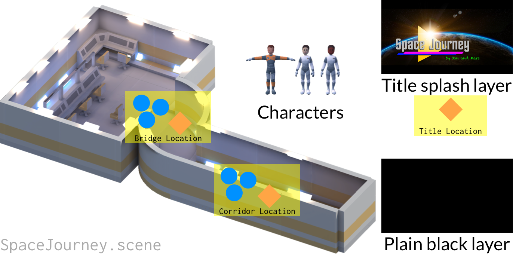
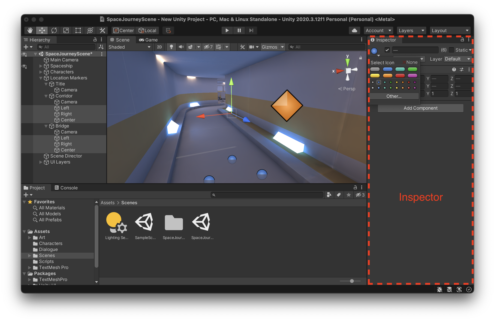
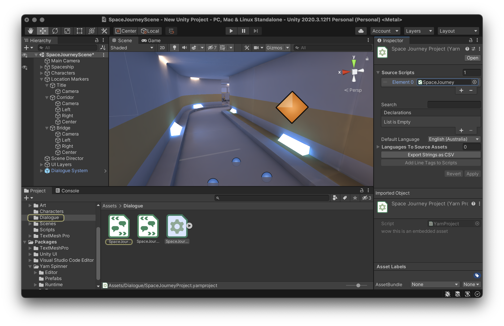
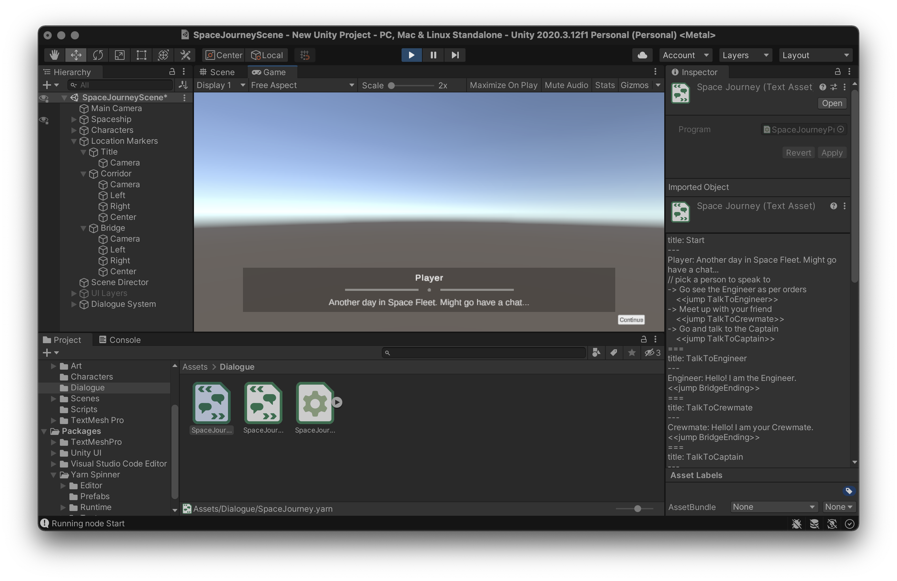
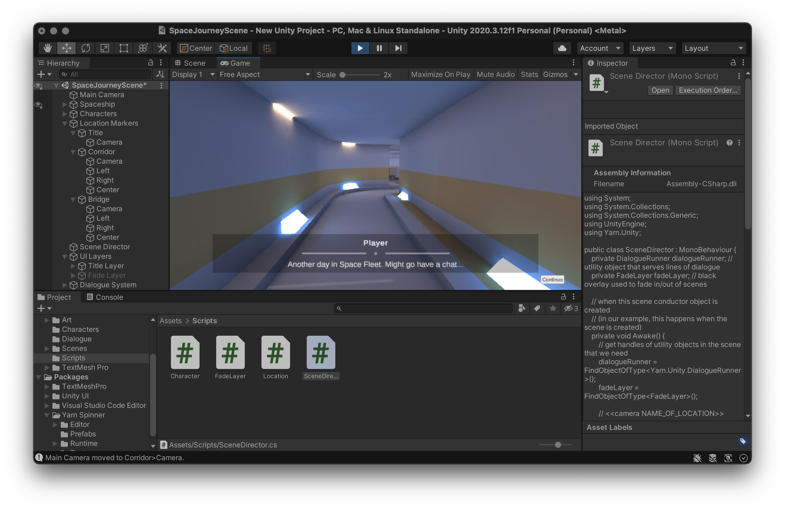
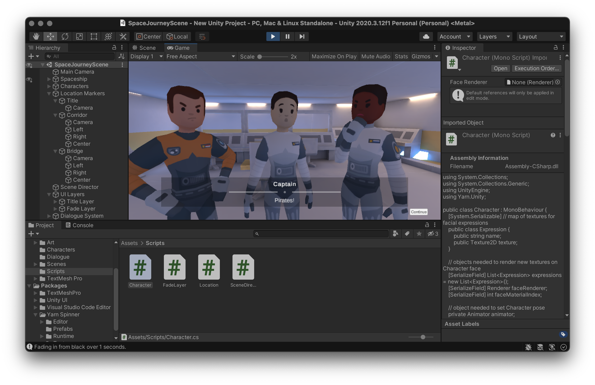

# 🛠 Project: Choose-Your-Path Game with Visuals

## Goals

1. Display Yarn dialogue in a Unity scene
2. Allow a player to select between options to respond
3. Use Yarn Spinner to trigger commands that change the scene, camera and characters

## Materials

* Yarn Spinner installed in Unity
* Yarn Spinner set up in a text editor
* [**Starter Asset Package**](https://github.com/thesecretlab/SpaceJourney/releases/download/v2.0/Space.Journey.Assets.v2.0.unitypackage) downloaded and unzipped

## Instructions

Open a new Unity 3D project. Ensure Yarn Spinner has been added to the project in the Package Manager as per the [**Installation Instructions**](installation-and-setup.md).


Drag the provided Asset Package into the **Project Window** where project files are displayed in Unity to import them into the project.



To see the **Scene** containing the imported assets, you'll need to open it. In the **Project Window**, navigate to **Assets > Scenes** and select **SpaceJourney.unity**.

This package includes with the following assets and functionality:

1. A simple, static environment called **Spaceship**.
2. Three **Character** models that each come with 6 available poses and 5 facial expressions.
3. **UI Layers** that appear in front of the camera to present a black screen or title screen.
4. **Location Markers** which are named but invisible objects in the scene that can act as anchors to move other objects to predefined positions.
5. Four **C# scripts** that are attached to some of the above objects to provide simple functions.

So the **Scene** looks somewhat like this, except that **Locations** and the markers within them are invisible. Here, orange diamond 🔶 icons are markers intended for the camera to move to and blue circle 🔵 icons are intended for characters.



You can see these markers yourself in Unity by selecting each marker in **Location Markers** and allocating them an Icon using the dropdown at the top of the **Inspector**. The markers named `Camera` are the camera markers and the ones named like `Left` or `Right` are character markers.



### Creating a Runnable Script


The next step is to import the Dialogue System and hook up a Yarn Project and Yarn Script. If you have completed [**Example Project 1**](example-project-1.md) before, you may skip ahead to [**Filling Out Your Script**](example-project-2.md#filling-out-your-script). Otherwise, let's proceed!


Yarn Spinner for Unity comes with a pre-made UI layer and accompanying utility scripts to handle displaying lines and presenting options from Yarn files. In the **Project Window** again, navigate to **Packages > Yarn Spinner > Prefabs** and drag **Dialogue System.prefab** into the scene.


When the **Dialogue System** in the scene is selected, the **Inspector** will display the Yarn Project it is expecting line from. Here, a **Yarn Project** is a kind of linking file that groups Yarn script files together. To make one, navigate to a sensible place for the file to live (such as **Assets > Dialogue**) and right-click the **Project Window** pane to select **Create > Yarn Spinner > Yarn Project**.


The existence of Yarn Projects allows larger games with multiple dialogue systems (e.g. main story dialogue, barks, storylets) to separate into multiple projects that pass lines to different UI or systems. This allows an extra level of organisation above separate Yarn files which are typically used to separate story scenes or parts.

However, most games will need only a single Yarn Project.


Select the scene's **Dialogue System** again and drag the new **Yarn Project** into the labelled slot in the **Inspector**.


Now the Yarn Project needs one or more **Yarn Scripts** to get dialogue from. Just like with the Yarn Project, navigate to the desired file location and select **Create > Yarn Spinner > Yarn Script**. Then, with the Yarn Project selected, drag the newly created script into the Inspector slot labelled **Source Scripts**. Click **Apply**.



### Filling Out Your Script

By default, a new Yarn Script begins with a single empty node with the name of the file. Open the file, rename the node to **Start** and put a single line of test dialogue. You may remove the `tags` field.

```
title: Start
---
This is a line of test dialogue.
===
```

Returning to Unity, pressing the ▶️ button results in the test line being displayed in front of the empty scene world. Pressing **Continue** will make the UI disappear, as it has reached the end of the script. If you do not see this, read onward for a common fix.



If you only see a black screen, the included fade-to-black layer is turned on and blocking the camera from seeing the scene. Hide this by selecting **UI Layers** from the **Scene Hierarchy** and unchecking the box at the top of the **Inspector**.



It's time to plan a story. In this Asset Package there are three character models called **Engineer**, **Crewmate** and **Captain**.


These low-poly spacefarers live and work on a spaceship with the player. It's a new day on the job in Space Fleet, the player is in the corridor and they must decide which of their three shipmates they're going to speak to. The choices presented are:

* The **Engineer**, who will complain to the player about his job.
* The **Crewmate**, who the player will attempt to convince should give them extra rations.
* The **Captain**, who will try to judge whether the player is ready for action.

After a short conversation with the chosen character, a shipwide alert requests all hands report to the bridge. When the player arrives, the **Captain** reveals that space pirates are attacking. Then one of two things happens:

1. If the player chose to speak to the **Captain** earlier, and **succeeded** in convincing her that they were ready for action, the player is sent to fight off the pirates and save the day.
2. If the player either didn't speak to the **Captain**, or **failed** to convince her that they were ready for action, the **Crewmate** is sent instead.

This short story provides an initial choice between three paths, and results in the player achieving one of two endings. A tree representation of the story would look as follows:


So it's time for the actual writing part. Here, I've opened my new Yarn Script in **Visual Studio Code** with the **Yarn Spinner Extension** installed as per the [**Installation Instructions**](broken-reference). I've written a minimal script that follows the planned story, as a skeleton that can be expanded on later.


You can find this example script below to copy. Or if you want to make you own version and need a refresher on how to represent it in Yarn, refer to the [**Syntax and File Structure guide**](../getting-started/writing-in-yarn/).

```
title: Start
---
Player: Another day in Space Fleet. Might go have a chat...
// pick a person to speak to
-> Go see the Engineer as per orders
    <<jump TalkToEngineer>>
-> Meet up with your friend
    <<jump TalkToCrewmate>>
-> Go and talk to the Captain
    <<jump TalkToCaptain>>
===
title: TalkToEngineer
---
Engineer: Hello! I am the Engineer.
<<jump BridgeEnding>>
===
title: TalkToCrewmate
---
Crewmate: Hello! I am your Crewmate.
<<jump BridgeEnding>>
===
title: TalkToCaptain
---
Captain: Hello! I am the Captain.
Player: I want to talk to go on more missions.
Captain: Do you think you are ready?
-> Yes
    <<set $away_mission_readiness += 1>>
    // if so, ask again
    Captain: Really?
    -> ...yes?
        <<set $away_mission_readiness += 1>>
    -> Actually, no.
-> No
// now go to the ending
<<jump BridgeEnding>>
===
title: BridgeEnding
---
// everyone reports to the bridge
Captain: Pirates!
Player: Oh no!
// now change who goes depending on player actions
<<if $away_mission_readiness < 2>>
    Captain: Crewmate, go deal with those pirates!
    Crewmate: Yes, Captain.
<<else>>
    Captain: Player, you were just telling me how ready for this you are. 
    Captain: Go deal with those pirates!
    Player: Hooray!
<<endif>>
===
```

Once you've got a basic story, pop back into Unity and check the basics:

* [x] Lines display correctly
* [x] Pressing **Continue** advances lines correctly
* [x] Selecting different options have the expected outcomes



### Adding Commands

Speaking to an empty void is all well and good, but this particular game is going to be more compelling if it makes use of the provided assets to make dynamic visuals. So to empower our Yarn script to invoke changes in Unity, we'll make some **Commands**. For this project, we'll make commands to:

* **Move the Camera** to preset locations, as if the player is moving.
* **Turn on and off UI elements**, to create nice transitions during Scene changes.
* **Move Character models** to preset locations, as if they are entering and exiting the Scene.
* **Change Character model animations and textures**, as if they are showing different emotions.

The first two will need to exist throughout the Scene, while the next two should attach to specific **Character** objects so each can be controlled independently. In **Assets > Scripts** there are four C# that have code to do each of these things (see headers below), so we just need to create commands that make the functionality availabe to Yarn scripts in the project.



```csharp
// this file is attached to an empty GameObject in the Scene to make these
// functions available whenever the Scene is running

// moves Main Camera to location {location}>Camera in the scene
private void MoveCamera(Location location);

// fades in from a black screen over {time} seconds
private Coroutine FadeIn(float time = 1f);

// fades out to a black screen over {time} seconds
private Coroutine FadeOut(float time = 1f);
```



```csharp
// this file is attached to every Character in the scene and so will affect only
// the targeted Character when functions are called

// moves Character to location {location}>{markerName} in the scene
public void Move(Location location, string markerName);

// tells the Character animator to jump to state {poseName} 
public void SetPose(string poseName);

// sets character expression texture to {expressionName} texture
public void SetExpression(string expressionName);
```



```csharp
// YOU WILL NOT HAVE TO CHANGE THIS FILE
// this file is attached to the FadeLayer in the Scene and its functions only
// exist for functions in SceneDirector.cs to call them

// fades CanvasGroup to transparency {alpha} over {time} seconds
public IEnumerator ChangeAlphaOverTime(float alpha, float time);
```



```csharp
// YOU WILL NOT HAVE TO CHANGE THIS FILE
// this file is attached to the parent Location object of markers in the Scene 
// and its functions only exist for functions in SceneDirector.cs and Character.cs 
// to call them

// finds marker {markerName} in this Location, if one exists
public Transform GetMarkerWithName(string markerName);
```



#### Scene-Wide Commands

Code for the scene-wide commands are included in **Assets > Scripts > SceneDirector.cs**. To make functions from the script available throughout the project, it is attached to an otherwise empty **GameObject** in the Scene called **Scene Director**.

With our first command we want to be able to be able to move the Scene's Main Camera to an invisible marker in the Scene with the given name. The function from **SceneDirector.cs** that we want to be able to invoke from Yarn is called `MoveCamera()` and it looks like this:

```csharp
// moves camera to camera location {location}>Camera in the scene
private void MoveCamera(Location location) {
    Transform destination = location.GetMarkerWithName("Camera");
    Camera.main.transform.position = destination.position;
    Camera.main.transform.rotation = destination.rotation;
}
```

It takes a **Location** in the Scene, from the eligible options **Title**, **Corridor** and **Bridge**. **\*\*It then finds the location and facing of the marker named **Camera** in that **Location\*\* and sets the camera location and facing to that of the marker.

If the camera moves to the **Title** location, the **Title Layer** element will fill the screen and appear as if a splash screen was being shown. If moved to the **Corridor** or **Bridge** locations, it acts as the point of view of the player who is then seen to be currently in that location. The default camera location is **Title**.

Here, we want to make a Yarn command called `camera` that takes a location name and knows to pass it off to the `MoveCamera()` function in C# to make it happen. This will mean when the player has to move to the bridge, the Yarn script can just say `<<camera Bridge>>`.

Making a command that can then be used in Yarn is as simple as registering a **Command Handler**. A Command Handler tells the **Dialogue System** that a Yarn command exists with a given name, how many additional pieces of information it needs, and which C# function to pass this information to when it's called. Then, when the game runs, the Dialogue System will handle talking to C# for you.

Command Handlers have two important requirements:

1. They must be created before the command can ever be called. Usually, this means you want to make it as part of the initial creation of the scene or the object it's attached to.&#x20;
2. They must be attached to the Dialogue System's **Dialogue Runner** object. It's the thing passing lines of dialogue to the scene that has to know to change behaviour if the next line it receives is a command instead of dialogue.

To satisfy the first point, we can register any Command Handlers in a function called `Awake()` that every Unity object has by default. This function is called when the object is created, and because our empty **Scene Director** object is always in the Scene this means it gets created as soon as the Scene does. Registering Command Handlers in the `Awake()` function of this object therefore means they will be registered before anything else happens when the game is run.

To satisfy the second, we need to find the **Dialogue Runner** in the scene and assign it to a variable in C# that we can then attach Command Handlers to. Because there is only one Dialogue Runner in the Scene, we can find it by asking Unity to give us all the objects in can find in the Scene of type DialogueRunner.

Altogether, this means two simple lines in the `Awake()` function of **SceneDirector.cs**:

```csharp
// find the Dialogue Runner
dialogueRunner = FindObjectOfType<Yarn.Unity.DialogueRunner>();
// register Command Handler for <<camera NAME_OF_LOCATION>>
dialogueRunner.AddCommandHandler<Location>("camera", MoveCamera);
```

The Dialogue Runner now supports a command called `camera`that has a parameter of type `Location` and will defer to the function `MoveCamera()` to make it happen.

Return to the Yarn script and add commands of syntax `<<camera (location name)>>` to the appropriate places:

* Add `<<camera Corridor>>` to the top of the **Start** node.
* Add `<<camera Bridge>>` to the top of the node where characters should move to the bridge.
* To show the title before the game begins, add `<<camera Title>>` at the top of **Start** and then a call to the inbuilt `<<wait (number of seconds)>>` command to hold for a second or two before moving to the Corridor.


If you hid the **Title Layer** object earlier, be sure to unhide it now by selecting it and re-ticking the box at the top of the **Inspector**. If necessary, unhide **UI Layers** and re-hide just the **Fade Layer**.


These minimal changes to the Yarn script...

```
title: Start
---
<<camera Title>>
<<wait 2>> // hold for 2 seconds before changing
<<camera Corridor>>
// ... [lines omitted]
===
title: BridgeEnding
---
// everyone reports to the bridge
<<camera Bridge>>
// ... [lines omitted]
===
```

...should now result in the camera moving around the empty environment in the appropriate points in the script. Returning to Unity, press the ▶️ button and playthrough to check this works correctly.


When Yarn script needs to pass an argument of a project-specific type (like **Location** is) it simply searches the scene for objects of that type with the given name, so make sure you spell and capitalise **Location** names exactly as they are in the Scene.




Onto the next command! Smash cuts are fine, but nice transitions are fancier. In the Scene there is a flat black layer called **Fade Layer** that sits in front of the camera. Changing its opacity can make the camera appear to fade to and from black. Back in **SceneDirector.cs** there is a line in the `Awake()` function that finds the objects of type **Fade** **Layer** in the Scene (there is only the one) and keeps it in a variable called `fadeLayer`, similar to how the **Dialogue Runner** was found earlier.

```csharp
// find the Fade Layer
fadeLayer = FindObjectOfType<FadeLayer>();
```


Remember to unhide the **Fade Layer** if you hid it earlier, otherwise this command won't be able to find it. Re-tick the box at the top of the Inspector.


Then further down the file there are short functions called `FadeIn()` and `FadeOut()` that do just that, by changing the opacity of this stored layer over the given number of seconds (or defaulting to **1** **second** if no argument is provided).

```csharp
// fades in from a black screen over {time} seconds
private Coroutine FadeIn(float time = 1f) {
    return StartCoroutine(fadeLayer.ChangeAlphaOverTime(0, time));
}

// fades out to a black screen over {time} seconds
private Coroutine FadeOut(float time = 1f) {
    return StartCoroutine(fadeLayer.ChangeAlphaOverTime(1, time));
}
```

These functions are a little different in that instead of returning nothing like the `MoveCamera()` function did, these functions return a `Coroutine`. This gives Yarn Spinner a handle to the process it triggered so that for operations that take time (like fading in a screen over a second or so) it knows not to trigger the next line of dialogue until that process has completed.

Again, the functionality that performs the actual opacity change is contained in a C# script attached to the relevant GameObject. In this case it is a file called **FadeLayer.cs** attached to the **Fade Layer**.

Adding commands for `fadeIn` and `fadeOut` works just like before. In the `Awake()` function of **SceneDirector.cs** by adding **Command Handlers** to the previously found **Dialogue Runner.**

```csharp
// Handlers for <<fadeIn DURATION>> and <<fadeOut DURATION>>
dialogueRunner.AddCommandHandler<float>("fadeIn", FadeIn);
dialogueRunner.AddCommandHandler<float>("fadeOut", FadeOut);
```

Back in the Yarn script, add a `<<fadeOut>>` and `<<fadeIn>>` to either side of each camera or node change to make nice fade-to-black transitions between story parts. Because no argument is provided, this will perform a 1 second fade.


Including transitions between conversation nodes even if they occur in the same Corridor location will hide the characters appearing that will be implemented next.



All this took is a few more additions to the Yarn script:

```
title: Start
---
<<fadeIn>>
<<camera Title>>
<<wait 2>> // hold for 2 seconds before changing
<<fadeOut>>
<<camera Corridor>>
<<fadeIn>>
// ... [lines omitted]
===
title: TalkToEngineer
---
<<fadeOut>>
<<fadeIn>>
// ... [lines omitted]
===
title: TalkToCrewmate
---
<<fadeOut>>
<<fadeIn>>
// ... [lines omitted]
===
title: TalkToCaptain
---
<<fadeOut>>
<<fadeIn>>
// ... [lines omitted]
===
title: BridgeEnding
---
<<fadeOut>>
// everyone reports to the bridge
<<camera Bridge>>
<<fadeIn>>
// ... [lines omitted]
<<fadeOut>>
===
```

#### Character-Specific Commands

The next command will allow character models to be placed in the Scene whenever they are part of the current conversation. We could write these as before in **SceneDirector.cs** with a function that takes a Character to change and what to change about them, but instead we're going to try out another type of command.

This time, we're going to add commands to the script that's attached to each **Character**-typed object in the scene, found at **Assets > Scripts > Character.cs**. This script has three main functions we want to use: `Move()`, `SetPose()` and `SetExpression()`.

In our example nobody ever leaves a location while the player is still there so there's no need to implement hide/show-like functionality; we can just cycle Characters between predefined Locations in the Scene.

First up in **Character.cs**, there is a function called `Move()` that accepts a `Location` object and the name of a marker in that Location. It looks very similar to the `MoveCamera()` function used earlier:

```csharp
// moves character to location {location}>{markerName} in the scene
public void Move(Location location, string markerName) {
    Transform destination = location.GetMarkerWithName(markerName);
    transform.position = destination.position;
    transform.rotation = destination.rotation;
}
```

Much like before with `MoveCamera()`, Yarn Spinner is able to find the Game Object you are trying to command by searching the Scene for one with the right type and name. This is used to find the Location that should be passed as the first function argument, but also to specify the target **Character** this function should be called _on_.

So if we want a command like `<<place (location) (marker name)>>` we need to add an extra argument in between to specify the target Character object: `<<place (character) (loc...>>`.

But this can't be done like before with a Command Handler registered when the object is created. Because **Character.cs** is attached to every **Character** object in the Scene, the `Awake()` function would be called every time _any_ Character was created. This would result in the Dialogue Runner receiving multiple registrations of command with the same name but that are requested to pass off to different objects. Yarn Spinner won't allow that, so we have to instead annotate the relevant functions using the **Yarn Command** decorator.

Declaring a Yarn Command is as simple as adding `[YarnCommand("command name")]` to the declaration of a function. Add the following decorator to just above the `Move()` function:

```csharp
// moves character to location {location}>{markerName} in the scene
[YarnCommand("place")]
public void Move(Location location, string markerName) {
```

Now in the Yarn script, just add commands to move the relevant **Character** to the desired marker in the current Location by adding `<<place (character name) (location) (marker name)>>` wherever needed. Placing characters _before_ calling `<<fadeIn>>` will ensure they are there before the shot appears, so the Character won't seem to pop into existence a fraction later.

Just a handful of additions to the Yarn script:

```
// ... [lines omitted]
title: TalkToEngineer
---
<<fadeOut>>
<<place Engineer Corridor Left>>
<<fadeIn>>
// ... [lines omitted]
===
title: TalkToCrewmate
---
<<fadeOut>>
<<place Crewmate Corridor Center>>
<<fadeIn>>
// ... [lines omitted]
===
title: TalkToCaptain
---
<<fadeOut>>
<<place Captain Corridor Right>>
<<fadeIn>>
// ... [lines omitted]
===
title: BridgeEnding
---
<<fadeOut>>
// everyone reports to the bridge
<<camera Bridge>>
<<place Engineer Bridge Left>>
<<place Crewmate Bridge Center>>
<<place Captain Bridge Right>>
<<fadeIn>>
// ... [lines omitted]
===
```

And now our **Characters** appear in the Scene whenever they're part of the current conversation.


Next, we're going to add some pose and facial expression changes to make Characters respond to the changing mood of the story. Primarily because it's a bit weird that everyone looks so cheerful during a crisis...


The `SetPose()` function in **Character.cs** accepts the name of a pose and tells the animator attached to the Character model to move the model to that pose. The available poses for each model are defined by their underlying type seen in **Assets > Art > CharacterBaseModels** and the Asset Package has come with the following for both male and female models:

* neutral
* hand-on-hip
* arms-out
* hand-at-mouth
* pointing
* hands-on-hips

Mostly these just move their arms into different basic positions. The function looks like this:

```csharp
// tell the animator to jump to state {poseName} 
public void SetPose(string poseName) {
    animator.Play("Base Layer." + poseName, 0);
}
```

As with the `place` command, add a decorator to `SetPose()` to declare a command called `pose`.

```csharp
[YarnCommand("pose")]
public void SetPose(string poseName) {
```

Now characters can be moved using `<<pose (character) (pose name)>>` wherever called for in the script. In particular, adding appropriately unhappy-looking poses during the Bridge scene will make Characters seem to respond to the story.

```
title: BridgeEnding
---
// ... [lines omitted]
<<pose Engineer hands-on-hips>>
<<pose Captain hand-at-mouth>>
<<fadeIn>>
Captain: Pirates!
Player: Oh no!
<<pose Captain pointing>>
// ... [lines omitted]
===
```

Next, do the exact same thing for expressions. The options included for each character in the Asset Package are:

* neutral
* happy
* angry
* smirk
* surprised

Facial expressions for the included characters are just a texture applied to the model's face, so changing expression just means asking the texture renderer to change face texture.

```csharp
// sets character expression texture to {expressionName} texture
public void SetExpression(string expressionName){
    // find the expression with the same name as we are looking for
    Expression expressionToUse = FindExpressionWithName(expressionName);
    SetFaceTexture(expressionToUse.texture);
}
```

Decorate with `[YarnCommand("expression")]` and, back in the Yarn script, place calls to `<<expression (character) (expression name)>>` wherever appropriate.



And that's it for commands! We successfully implemented commads to:

* [x] **Move the Camera** to preset locations, as if the player is moving.
* [x] **Turn on and off UI elements**, to create nice transitions during Scene changes.
* [x] **Move Character models** to preset locations, as if they are entering and exiting the Scene.
* [x] **Change Character model animations and textures**, as if they are showing different emotions.

### Draw the Rest of the Owl

Now that all the commands are hooked up and the skeleton story plays through correctly, it's time to replace the skeleton placeholder script with the full story. In **Assets > Dialogue** find the file **SpaceJourney\_FinalVersion.yarn**. In the **Yarn Project** created earlier, replace the script you placed in **Source Scripts** earlier with this script instead.


## Result

A playable visual novel-type game with multiple characters and scenes and sensible transitions between them.


An easy way to spice this up is to just try replacing provided assets with ones of your own choosing. There are plenty of publically available asset packs with permissive licenses to play with, and re-theming a starter game and building from there can be easier than starting from scratch.

Or you could try your hand at C# and create more advanced commands that can be made available to Yarn. Add new Locations, or camera motion. The sky's the limit! Yarn Spinner is perfect for allowing iterative and creative development.
