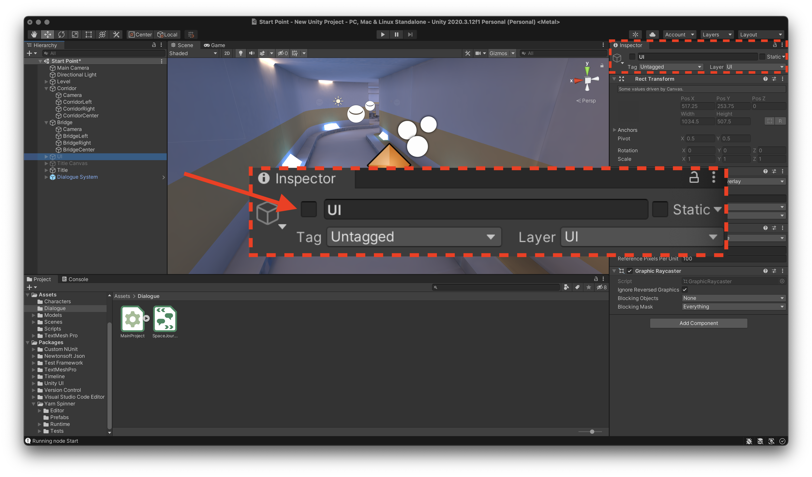

# 📝 Example Project 2

## Goals

1. Display Yarn dialogue in a Unity scene
2. Allow a player to select between options to respond
3. Use Yarn Spinner to trigger commands that change the scene, camera and characters

## Materials

* Yarn Spinner installed in Unity
* Yarn Spinner set up in a text editor
* **Starter Asset Package** downloaded and unzipped

## Instructions

Open a new Unity 3D project. Ensure Yarn Spinner has been added to the project in the Package Manager as per the [**Installation Instructions**](installation-and-setup.md).


Drag the provided Asset Package into the **Project Window** where project files are displayed in Unity to import them into the project.


To see the **Scene** containing the imported assets, you'll need to open it. In the **Project Window**, navigate to **Assets &gt; Scenes** and select **Start Point.unity**.

This package comes with three main things: 

1. character models for three different humans in spacesuits, 
2. a simple environment styled like the inside of a spaceship, and 
3. some basic C\# utility scripts that will be covered in more detail shortly.

The important part to know is that in the **Scene** there are a number of named but invisible markers—Game Objects with no model attached—that just store a location and a facing. These will be used as anchors to move other models around by sending them to markers based on name.


You can see these yourself in Unity by selecting each marker and allocating them an Icon using the dropdown at the top of the **Inspector**. The markers named `Camera` are the camera markers and the ones named like `CorridorLeft` or `BridgeRight` are character markers.


### Creating a Runnable Script


The next step is to import the Dialogue System and hook up a Yarn Project and Yarn Script. If you have completed [**Example Project 1**](example-project-1.md) before, you may skip ahead to **Planning a Story**. Otherwise, let's proceed!


Yarn Spinner for Unity comes with a pre-made UI layer and accompanying utility scripts to handle displaying lines and presenting options from Yarn files. In the **Project Window** again, navigate to **Packages &gt; Yarn Spinner &gt; Prefabs** and drag **Dialogue System.prefab** into the scene.


When the **Dialogue System** in the scene is selected, the **Inspector** will display the Yarn Project it is expecting line from. Here, a **Yarn Project** is a kind of linking file that groups Yarn script files together. To make one, navigate to a sensible place for the file to live \(such as a new folder **Assets &gt; Dialogue**\) and right-click the **Project Window** pane to select **Create &gt; Yarn Spinner &gt; Yarn Project**.


The existence of Yarn Projects allows larger games with multiple dialogue systems \(e.g. main story dialogue, barks, storylets\) to separate into multiple projects that pass lines to different UI or systems. This allows an extra level of organisation above separate Yarn files which are typically used to separate story scenes or parts.

However, most games will need only a single Yarn Project.


Select the scene's **Dialogue System** again and drag the new **Yarn Project** into the labelled slot in the **Inspector**.


Now the Yarn Project needs one or more **Yarn Scripts** to get dialogue from. Just like with the Yarn Project, navigate to the desired file location and select **Create &gt; Yarn Spinner &gt; Yarn Script**. Then, with the Yarn Project selected, drag the newly created script into the Inspector slot labelled **Source Scripts**. Click **Apply**.


### Filling Out your Script

By default, a new Yarn Script begins with a single empty node with the name of the file. Open the file, rename the node to **Start** and put a single line of test dialogue. You may remove the `tags` field.

```text
title: Start
---
This is a line of test dialogue.
===
```

Returning to Unity, pressing the ▶️ button results in the test line being displayed in front of the empty scene world. Pressing **Continue** will make the UI disappear, as it has reached the end of the script. If you do not see this, read onward for a common fix.



If you only see a black screen, the included "fade to black" layer is turned on and blocking the camera from seeing the scene. Hide this by selecting **UI** from the **Scene Hierarchy** and unchecking the box for each at the top of the **Inspector** as shown below. Do the same for the **Title Canvas**.




It's time to plan a story. In this Asset Package there are three character models called **Engineer**, **Crewmate** and **Captain**.


These low-poly spacefarers live and work on a spaceship with the player. It's a new day on the job in Space Fleet and the player must decide which of these three characters they're going to speak to first. 

* The **Engineer**, who will complain to the player about his job.
* The **Crewmate**, who the player will attempt to convince should give them extra rations.

### Adding Commands


## Result

A playable visual novel-type game with multiple characters and scenes and sensible transitions between them.

