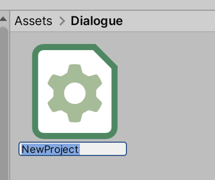
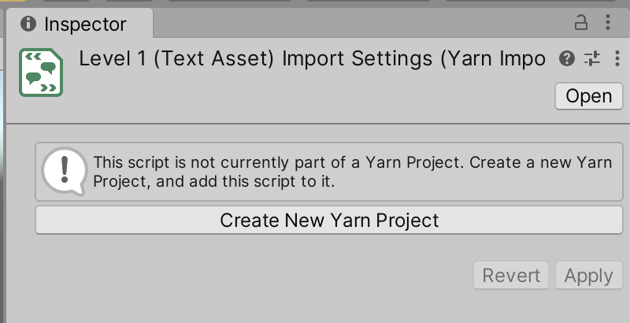
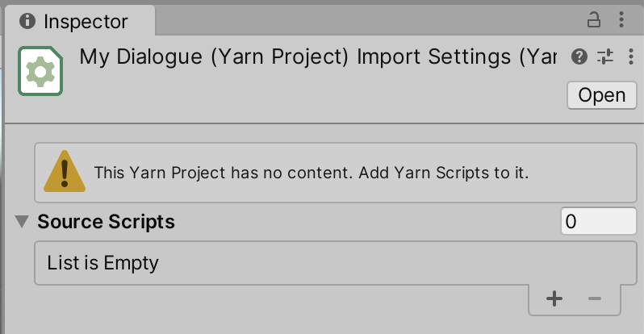

# Yarn Projects

A Yarn Project is a file that links multiple [Yarn scripts](yarn-scripts.md) together. Yarn projects are how Dialogue Runners work with your content.

## Creating a New Yarn Project

To create a new Yarn Project, follow these steps:

* Open the Assets menu, and choose Yarn Spinner -> Yarn Project.
* Unity will create a new file. Type in a name for the file, and press return.

This new Yarn Project will be empty, and won't contain any references to other Yarn scripts. To add them, see [Adding Yarn Scripts to a Project](yarn-projects.md#adding-yarn-scripts-to-a-project).

### Creating a Project from a Script

When you create a Yarn script in your project for the first time, you'll also need to create a Yarn Project and add the script to it.&#x20;

You can create a new, empty Yarn Project by following the instructions in [Yarn Projects](yarn-projects.md#creating-a-new-yarn-project), or you can create and set up a new project with this script by following these steps:

* Select the Yarn script in the Project pane.
* In the Inspector, click the Create New Yarn Project button.

* Clicking this button does two things:
  * A new Yarn Project will be created next to the Yarn script.
  * The new Yarn Project will be set up to include the Yarn script you created it from in its list of source scripts.

## Adding Yarn Scripts to a Project

On their own, a Yarn Project doesn't do anything. In order to be useful, you need to add Yarn scripts to it.

## Using Yarn Projects with Dialogue Runners

## Inspector

|Property|Description|
|---|---|
|Source Scripts|The list of Yarn Scripts that this Yarn Project uses.|
|Declarations|The list of variables that are declared in this Yarn Project, or in the Yarn Scripts that this project uses.|
|Default Language|The language that the Yarn Scripts are written in.|
|Languages to Source Assets|A mapping of languages to string tables and associated assets. See [Adding Localizations and Assets to Projects](../assets-and-localization/README.md) for more information.|
|Use Addressable Assets|
If this is turned on, the Yarn Project will configure itself to look for assets using the [Addressable Assets](https://docs.unity3d.com/Packages/com.unity.addressables@latest/index.html) system. See [Using Addressable Assets](../addressable-assets/README.md) for more information.

This checkbox will only appear if the Addressable Assets package is installed in your project.
|
|Update Asset Addresses|When you click this button, all of the assets in the folders specified in the Languages to Source Assets list will have their address updated to match the line ID they refer to. See [Using Addressable Assets](../addressable-assets/README.md) for more information.|
|Export Strings as CSV|When you click this button, all of the lines in the Yarn Scripts that this project uses will be written to a `.csv` file, which can be translated to other languages. See [Adding Localizations and Assets to Projects](../assets-and-localization/README.md) for more information.|
|Update Existing Strings Files|When you click this button, all `.csv` strings files that are configured in the Languages to Source Assets list will be updated with any lines that have been added, modified or deleted since the strings file was created. See [Adding Localizations and Assets to Projects](../assets-and-localization/README.md) for more information.|
|Add Line Tags to Scripts|When you click this button, any line of dialogue in the Source Scripts list that doesn't have a `#line:` tag will have one added. See [Adding Localizations and Assets to Projects](../assets-and-localization/README.md) for more information.|