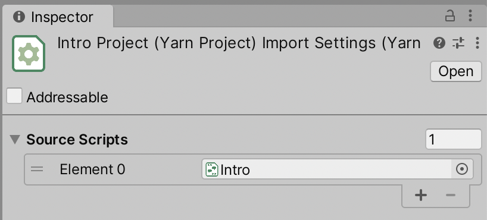
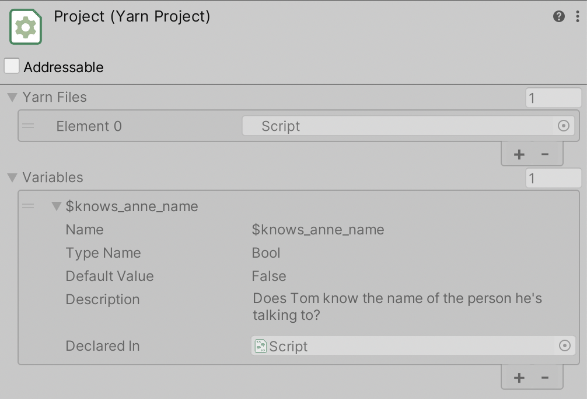

# Yarn Projects

A Yarn Project is a file that links multiple [Yarn scripts](yarn-scripts.md) together. Yarn projects are how Dialogue Runners work with your content.

## Creating a New Yarn Project

To create a new Yarn Project, follow these steps:

* Open the Assets menu, and choose Yarn Spinner -> Yarn Project.
* Unity will create a new file. Type in a name for the file, and press return.

This new Yarn Project will be empty, and won't contain any references to other Yarn scripts yet.

## Adding Yarn scripts to a Yarn Project

On their own, a Yarn Project doesn't do anything. In order to be useful, you need to add Yarn scripts to it.

To add Yarn scripts to a Yarn Project, follow these steps:

* Select the Yarn Project in the Project Pane.
* In the Inspector, open the Source Scripts property at the top of the pane.
* Drag the Yarn script you want to add into the Source Scripts list.
* Click Apply at the bottom of the pane.

### Creating a Project from a Script

As an alternative to creating an empty project and adding scripts to it, you can create a new Yarn Project from a script. To do this, follow these steps:

* Select the Yarn script in the Project pane.
* In the Inspector, click the Create New Yarn Project button.

* Clicking this button does two things:
  * A new Yarn Project will be created next to the Yarn script.
  * The new Yarn Project will be set up to include the Yarn script you created it from in its list of source scripts.

## Managing Variables

A Yarn Project's inspector shows information about every [variable](../../getting-started/writing-in-yarn/logic-and-variables.md) that are used in the Yarn scripts. This section of the Inspector shows the name, type, description, and default value of each variable.

This information comes from the following locations:
* All variables that have been declared in a Yarn script with a `declare` statement
* All variables that have been manually added to this Yarn project
* All variables that are used, but don't have a `declare` statement


Declaring a variable in a Yarn script by using a `declare` statement, or by manually adding it to the variables list, allows you to ensure that the variable is of the type you expect it to be, and that it has a description that explains the intended purpose of the variable.

If you don't declare a variable, Yarn Spinner will attempt to figure the variable's type out based on how it's used, and won't be able to provide a description.


## Managing Localisations and Assets

When you write a Yarn script, you write it in a specific human language. This is referred to as the 'base' language of the script. It's called the base language because it's the one you start with, and the one you translate into other languages. 


Unless you change it to something else, Yarn Spinner will set the base language to your computer's current locale.


You can set the base language of a Yarn Project in the Inspector by changing the Base Language setting.

If you want to translate your scripts into another language, or if you want to associate each line with assets (like voice over audio clips), you create a new Localisation. To learn about this process, see [Adding Localizations and Assets to Projects](../assets-and-localization/README.md).

## Using Yarn Projects with Dialogue Runners

Yarn Projects are used by Dialogue Runners. When a Dialogue Runner is told to start running dialogue, it reads it from the Yarn Project it's been provided.


If you try to start a Dialogue Runner and it doesn't have a Yarn Project, or the Yarn Project doesn't have any Yarn scripts, or if any of the Yarn scripts contain an error, the Dialogue Runner won't be able to run.


## Inspector

|Property|Description|
|---|---|
|Source Scripts|The list of Yarn Scripts that this Yarn Project uses.|
|Declarations|The list of variables that are declared in this Yarn Project, or in the Yarn Scripts that this project uses.|
|Base Language|The language that the Yarn Scripts are written in.|
|Localisations|A mapping of languages to string tables and associated assets. See [Adding Localizations and Assets to Projects](../assets-and-localization/README.md) for more information.|
|Search All Assemblies|
If this is turned on, Yarn Spinner will search for [custom commands and functions](../creating-commands-functions.md) in all of your project's code and packages.

If this is turned off, it will only search for them in the default assembly, and in the assemblies specified in Assemblies to Search.

By default, this is turned on.
|
|Assemblies To Search|
If Search All Assemblies is turned off, Yarn Spinner will search for commands and actions in the assemblies you specify in this list, as well as the default assembly.

This list will only appear if Search All Assemblies is turned off.
|
|Use Addressable Assets|
If this is turned on, the Yarn Project will configure itself to look for assets using the [Addressable Assets](https://docs.unity3d.com/Packages/com.unity.addressables@latest/index.html) system. 
This checkbox will only appear if the Addressable Assets package is installed in your project.
|
|Update Asset Addresses|When you click this button, all of the assets in the folders specified in the Languages to Source Assets list will have their address updated to match the line ID they refer to.|
|Export Strings as CSV|When you click this button, all of the lines in the Yarn Scripts that this project uses will be written to a `.csv` file, which can be translated to other languages. See [Adding Localizations and Assets to Projects](../assets-and-localization/README.md) for more information.|
|Update Existing Strings Files|When you click this button, all `.csv` strings files that are configured in the Languages to Source Assets list will be updated with any lines that have been added, modified or deleted since the strings file was created. See [Adding Localizations and Assets to Projects](../assets-and-localization/README.md) for more information.|
|Add Line Tags to Scripts|When you click this button, any line of dialogue in the Source Scripts list that doesn't have a `#line:` tag will have one added. See [Adding Localizations and Assets to Projects](../assets-and-localization/README.md) for more information.|