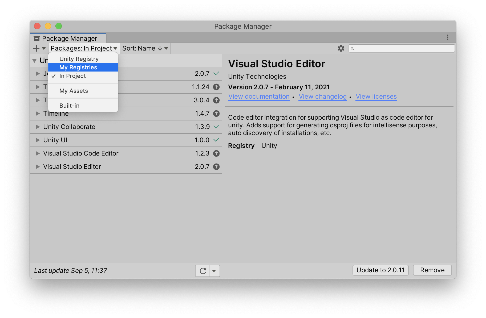
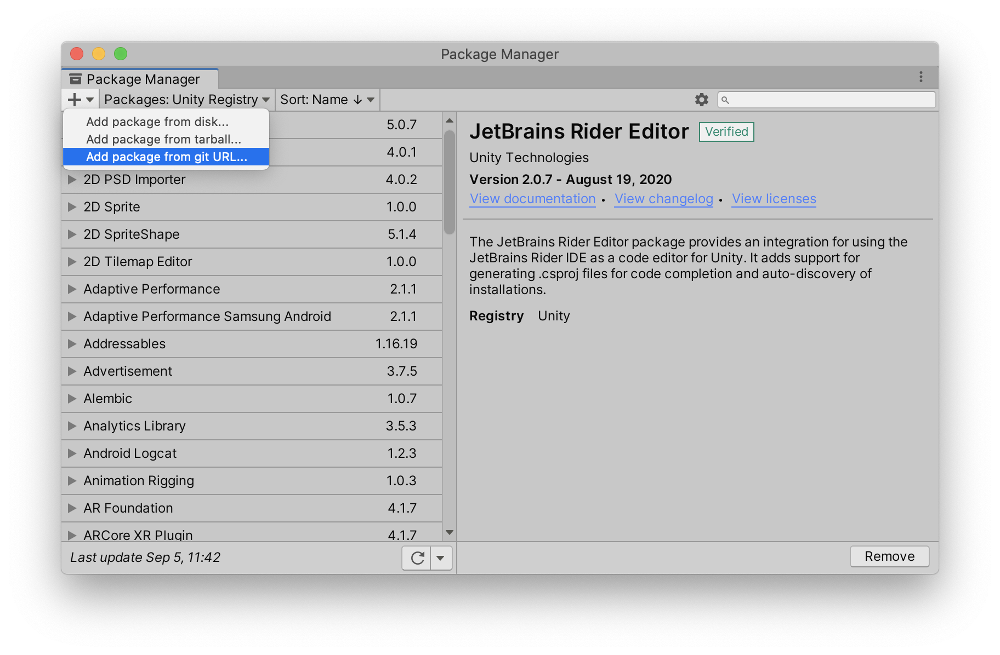

# 📦 Installation

The main way we recommend to install Yarn Spinner for Unity is via the Package Manager.

## Install via the Unity Package Manager (recommended)

You can install the Yarn Spinner package into your project using the Package Manager window in Unity.

Yarn Spinner is available via the [OpenUPM registry](https://openupm.com). This is the simplest way to install Yarn Spinner, and makes it easy to keep it up to date.


In order to follow the instructions in this section, your project needs to be using Unity 2020.1 or higher. If your project is using an earlier version of Unity, we recommend installing Yarn Spinner from Git.


### Setting Up the OpenUPM Registry in Your Project

Before you can install Yarn Spinner from OpenUPM, you first need to configure your project so that it knows where to get the package from.

1. In Unity, open the Edit menu, and choose Project Settings.
2. In the list of sections at the left hand side of the window, select Package Manager.

This window is where you tell Unity about where to find packages that come from registries besides Unity's built-in one.

1. In the Name field, type `OpenUPM`.
2. In the URL field, type `https://package.openupm.com`.
3. In the Scopes field, type `dev.yarnspinner`.
4. Click Save.

When you're done, the settings window should look like this:

You can now install Yarn Spinner itself.

### Installing the Yarn Spinner package

1. Open the Window menu, and choose Package Manager.
2. In the toolbar, click Packages: In Project, and choose My Registries.

1. Yarn Spinner will appear in the list. Select it, and click Install.

Yarn Spinner will download and install into your project.

You can verify that everything is imported succesfully by looking for Yarn Spinner under Packages, in the Project pane.

## Install from GitHub

As an alternative to downloading Yarn Spinner from OpenUPM, you can install Yarn Spinner by downloading the package directly from GitHub, where the project's source code is stored.


Where possible, we recommend installing Yarn Spinner from OpenUPM rather than GitHub, because it's easier to update to new versions.


To install Yarn Spinner from GitHub, follow these instructions.

1. In Unity, open the Window menu, and choose Package Manager.
2. Click the `+` button, and choose "Add package from git URL".

1. In the text field that appears, enter the following URL: **`https://github.com/YarnSpinnerTool/YarnSpinner-Unity.git`**.


Be sure to type the URL exactly as it appears in this document, or the installation won't work.


1. The project will download and install. This might take a moment.

## Next Steps

Once you've installed Yarn Spinner, you're ready to start using it!
